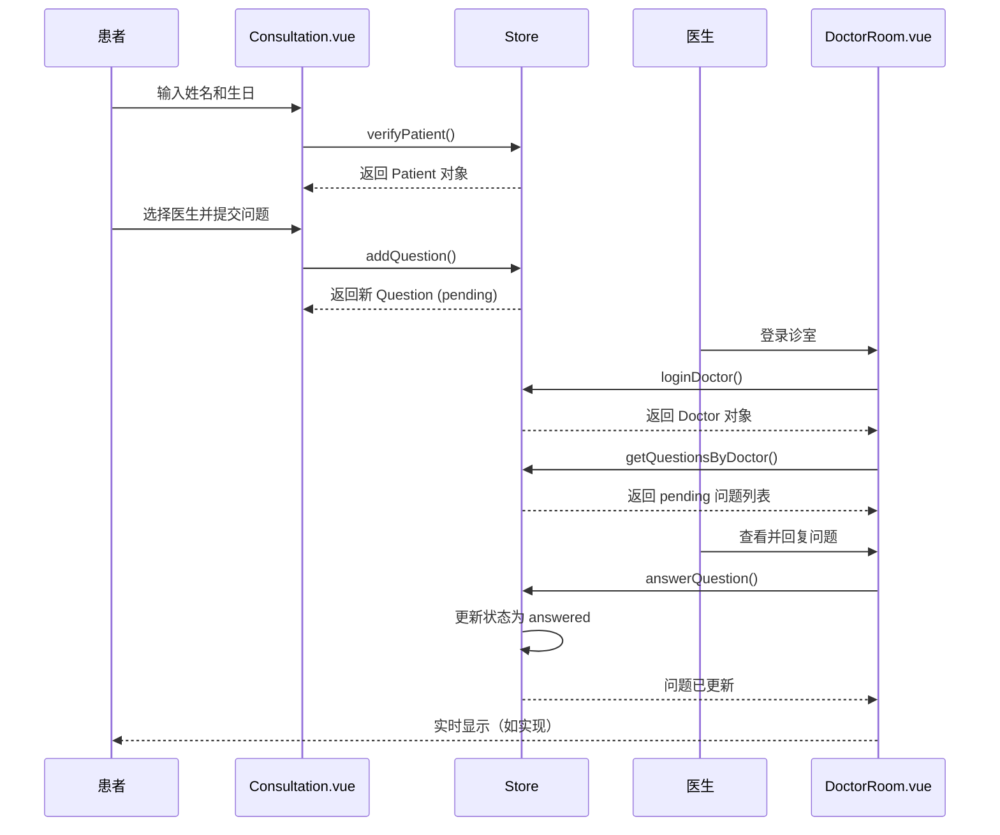

# API 接口文档

## 概述

本文档定义了 QA Live Healthcare 在线医疗问诊平台的应用接口。平台采用前端 SPA（单页应用）架构，使用 Vue 3 + TypeScript 构建，后端交互通过本地 Store 状态管理实现。

**注意**: 本项目为前端原型，数据存储于内存中（刷新后重置）。生产环境应接入真实后端 API。

## 技术架构

| 层级 | 技术 | 说明 |
|------|------|------|
| 前端框架 | Vue 3.5.10 | Composition API + `<script setup>` |
| 状态管理 | Vue Reactive | 本地状态管理 |
| UI 组件 | Ant Design Vue 4.2.6 | 企业级 UI 组件库 |
| 路由 | Vue Router 4.6.3 | 前端路由 |
| 构建工具 | Vite 5.4.8 | 快速开发服务器 |

## 路由接口

### 页面路由

| 路径 | 组件 | 功能 | 访问权限 |
|------|------|------|----------|
| `/` | Home.vue | 首页 | 公开 |
| `/consultation` | Consultation.vue | 通用问诊页 | 公开 |
| `/consultation/:doctorUsername` | Consultation.vue | 指定医生问诊 | 公开 |
| `/doctors` | Doctors.vue | 医生列表 | 公开 |
| `/about` | About.vue | 关于页面 | 公开 |
| `/doctor/login` | DoctorLogin.vue | 医生登录 | 公开 |
| `/doctor/room/:username` | DoctorRoom.vue | 医生诊室 | 需登录 |

### 路由参数

```typescript
// 问诊页 - 指定医生
/consultation/:doctorUsername
参数: doctorUsername (string) - 医生用户名

示例: /consultation/dr-zhang-wei

// 医生诊室
/doctor/room/:username
参数: username (string) - 医生用户名

示例: /doctor/room/dr-zhang-wei
```

## Store API

Store 是应用的核心状态管理模块，位于 `src/store/index.ts`。

### 医生管理 API

#### loginDoctor

**签名**:
```typescript
loginDoctor(username: string, password: string): Doctor | null
```

**说明**: 验证医生登录凭证并设置当前登录医生。

**参数**:
| 参数 | 类型 | 必填 | 说明 |
|------|------|------|------|
| username | string | 是 | 医生用户名 |
| password | string | 是 | 登录密码 |

**返回值**: 成功返回 Doctor 对象，失败返回 null

**示例**:
```typescript
const doctor = store.loginDoctor('dr-zhang-wei', '123456');
if (doctor) {
  console.log('登录成功:', doctor.name);
}
```

#### logoutDoctor

**签名**:
```typescript
logoutDoctor(): void
```

**说明**: 清除当前登录医生状态。

**示例**:
```typescript
store.logoutDoctor();
```

#### getDoctorByUsername

**签名**:
```typescript
getDoctorByUsername(username: string): Doctor | undefined
```

**说明**: 根据用户名获取医生信息。

**参数**:
| 参数 | 类型 | 必填 | 说明 |
|------|------|------|------|
| username | string | 是 | 医生用户名 |

**示例**:
```typescript
const doctor = store.getDoctorByUsername('dr-zhang-wei');
```

#### getActiveDoctors

**签名**:
```typescript
getActiveDoctors(): Doctor[]
```

**说明**: 获取所有在线（活跃）医生列表。

**返回值**: Doctor[] - 活跃医生数组

**示例**:
```typescript
const activeDoctors = store.getActiveDoctors();
```

---

### 患者管理 API

#### verifyPatient

**签名**:
```typescript
verifyPatient(name: string, birthday: string): Patient
```

**说明**: 验证患者身份，如不存在则自动创建。

**参数**:
| 参数 | 类型 | 必填 | 说明 |
|------|------|------|------|
| name | string | 是 | 患者姓名 |
| birthday | string | 是 | 出生日期 (YYYY-MM-DD) |

**返回值**: Patient 对象

**示例**:
```typescript
const patient = store.verifyPatient('赵明', '1985-03-15');
```

#### logoutPatient

**签名**:
```typescript
logoutPatient(): void
```

**说明**: 清除当前患者状态。

**示例**:
```typescript
store.logoutPatient();
```

---

### 问诊管理 API

#### addQuestion

**签名**:
```typescript
addQuestion(question: Omit<Question, 'id' | 'submitTime' | 'status' | 'answer' | 'answerTime'>): Question
```

**说明**: 添加新的问诊问题。

**参数**:
```typescript
{
  patientId: string;    // 患者 ID
  patientName: string;  // 患者姓名
  doctorId: string;     // 医生 ID
  doctorName: string;   // 医生姓名
  question: string;     // 问题内容
}
```

**返回值**: 新创建的 Question 对象

**示例**:
```typescript
const newQuestion = store.addQuestion({
  patientId: 'patient001',
  patientName: '赵明',
  doctorId: 'doc001',
  doctorName: '张伟医生',
  question: '最近总是感觉胸闷气短...',
});
```

#### answerQuestion

**签名**:
```typescript
answerQuestion(questionId: string, answer: string): void
```

**说明**: 医生回复指定问题。

**参数**:
| 参数 | 类型 | 必填 | 说明 |
|------|------|------|------|
| questionId | string | 是 | 问题 ID |
| answer | string | 是 | 回复内容 |

**示例**:
```typescript
store.answerQuestion('q001', '根据您的描述,建议您做个心电图检查...');
```

#### markQuestionAsAnswered

**签名**:
```typescript
markQuestionAsAnswered(questionId: string): void
```

**说明**: 标记问题为已解答（口述解答）。

**参数**:
| 参数 | 类型 | 必填 | 说明 |
|------|------|------|------|
| questionId | string | 是 | 问题 ID |

**示例**:
```typescript
store.markQuestionAsAnswered('q002');
```

#### getQuestionsByDoctor

**签名**:
```typescript
getQuestionsByDoctor(doctorId: string): Question[]
```

**说明**: 获取指定医生的所有问题。

**参数**:
| 参数 | 类型 | 必填 | 说明 |
|------|------|------|------|
| doctorId | string | 是 | 医生 ID |

**示例**:
```typescript
const questions = store.getQuestionsByDoctor('doc001');
```

#### getQuestionsByPatient

**签名**:
```typescript
getQuestionsByPatient(patientId: string): Question[]
```

**说明**: 获取指定患者的所有问题。

**参数**:
| 参数 | 类型 | 必填 | 说明 |
|------|------|------|------|
| patientId | string | 是 | 患者 ID |

**示例**:
```typescript
const questions = store.getQuestionsByPatient('patient001');
```

---

### 统计分析 API

#### getStatistics

**签名**:
```typescript
getStatistics(): {
  totalDoctors: number;      // 医生总数
  totalQuestions: number;    // 问题总数
  activeSessions: number;    // 待回答问题数
  totalSessions: number;     // 在线医生数
}
```

**说明**: 获取平台统计数据。

**示例**:
```typescript
const stats = store.getStatistics();
console.log(`医生总数: ${stats.totalDoctors}`);
console.log(`待响应问题: ${stats.activeSessions}`);
```

---

## 数据模型

### Doctor

```typescript
interface Doctor {
  id: string;           // 唯一标识符
  username: string;     // 登录用户名
  password: string;     // 登录密码
  name: string;         // 医生姓名
  title: string;        // 职称 (如: 主任医师)
  department: string;   // 科室 (如: 心内科)
  avatar: string;       // 头像 URL
  experience: string;  // 从业经验 (如: 15年临床经验)
  specialties: string[]; // 专业领域列表
  isActive: boolean;    // 是否在线
}
```

**示例**:
```json
{
  "id": "doc001",
  "username": "dr-zhang-wei",
  "password": "123456",
  "name": "张伟医生",
  "title": "主任医师",
  "department": "心内科",
  "avatar": "https://images.pexels.com/.../photo.jpg",
  "experience": "15年临床经验",
  "specialties": ["高血压", "冠心病", "心律失常"],
  "isActive": true
}
```

### Patient

```typescript
interface Patient {
  id: string;      // 唯一标识符
  name: string;    // 患者姓名
  birthday: string; // 出生日期 (YYYY-MM-DD)
  phone: string;    // 联系电话 (部分隐藏)
  gender: string;   // 性别
}
```

**示例**:
```json
{
  "id": "patient001",
  "name": "赵明",
  "birthday": "1985-03-15",
  "phone": "138****1234",
  "gender": "男"
}
```

### Question

```typescript
interface Question {
  id: string;            // 唯一标识符
  patientId: string;     // 患者 ID
  patientName: string;   // 患者姓名
  doctorId: string;      // 医生 ID
  doctorName: string;    // 医生姓名
  question: string;       // 问题内容
  submitTime: string;    // 提交时间 (ISO 8601)
  status: 'pending' | 'answered';  // 状态
  answer: string | null; // 回复内容
  answerTime: string | null;  // 回复时间
}
```

**示例**:
```json
{
  "id": "q001",
  "patientId": "patient001",
  "patientName": "赵明",
  "doctorId": "doc001",
  "doctorName": "张伟医生",
  "question": "最近总是感觉胸闷气短...",
  "submitTime": "2025-11-02T09:30:00",
  "status": "answered",
  "answer": "根据您的描述,建议做个心电图检查...",
  "answerTime": "2025-11-02T09:45:00"
}
```

---

## 组件调用示例

### 患者问诊流程

```typescript
// 1. 验证患者身份
const patient = store.verifyPatient('赵明', '1985-03-15');

// 2. 获取在线医生
const doctors = store.getActiveDoctors();
const selectedDoctor = doctors[0];

// 3. 提交问题
const question = store.addQuestion({
  patientId: patient.id,
  patientName: patient.name,
  doctorId: selectedDoctor.id,
  doctorName: selectedDoctor.name,
  question: '最近总是感觉胸闷气短...',
});

console.log('问题已提交:', question.id);
```

### 医生回复流程

```typescript
// 1. 医生登录
const doctor = store.loginDoctor('dr-zhang-wei', '123456');
if (!doctor) {
  console.error('登录失败');
  return;
}

// 2. 获取待回答问题
const pendingQuestions = store.getQuestionsByDoctor(doctor.id)
  .filter(q => q.status === 'pending');

// 3. 回复问题
if (pendingQuestions.length > 0) {
  store.answerQuestion(pendingQuestions[0].id, '建议您做个心电图检查...');
}

// 4. 获取统计数据
const stats = store.getStatistics();
console.log(`待回答问题: ${stats.activeSessions}`);
```

---

## 测试账号

### 医生账号

| 用户名 | 密码 | 姓名 | 科室 | 在线状态 |
|--------|------|------|------|----------|
| dr-zhang-wei | 123456 | 张伟医生 | 心内科 | 在线 |
| dr-li-na | 123456 | 李娜医生 | 儿科 | 在线 |
| dr-wang-qiang | 123456 | 王强医生 | 骨科 | 在线 |
| dr-liu-min | 123456 | 刘敏医生 | 妇产科 | 离线 |
| dr-chen-jie | 123456 | 陈杰医生 | 消化内科 | 在线 |

### 患者

患者账号无需预先创建，首次输入姓名和生日后自动创建。

---

## 数据流转图



---

## 源代码引用

| 模块 | 文件路径 | 说明 |
|------|----------|------|
| Store 定义 | `src/store/index.ts:1-158` | 所有状态和 API |
| 数据接口 | `src/store/index.ts:6-38` | TypeScript 接口定义 |
| 医生数据 | `src/data/doctor-user-list.json` | 医生初始数据 |
| 患者数据 | `src/data/patient-user.json` | 患者初始数据 |
| 问题数据 | `src/data/question-list.json` | 问题初始数据 |

---

*本 API 文档会随接口变更而更新。使用 `/asdm-context-update` 更新上下文。*
