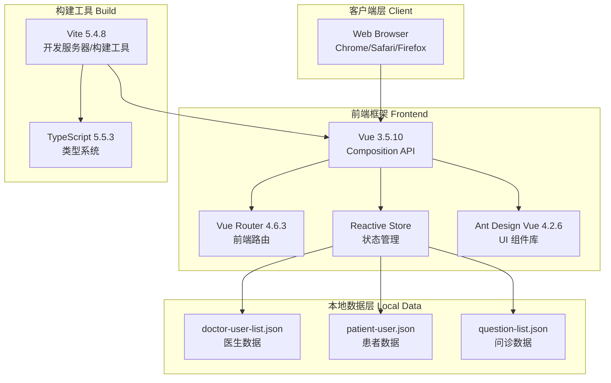
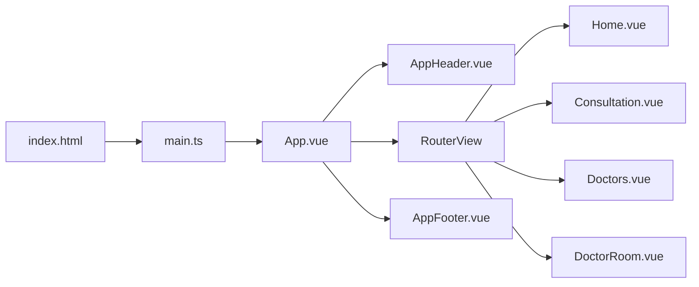
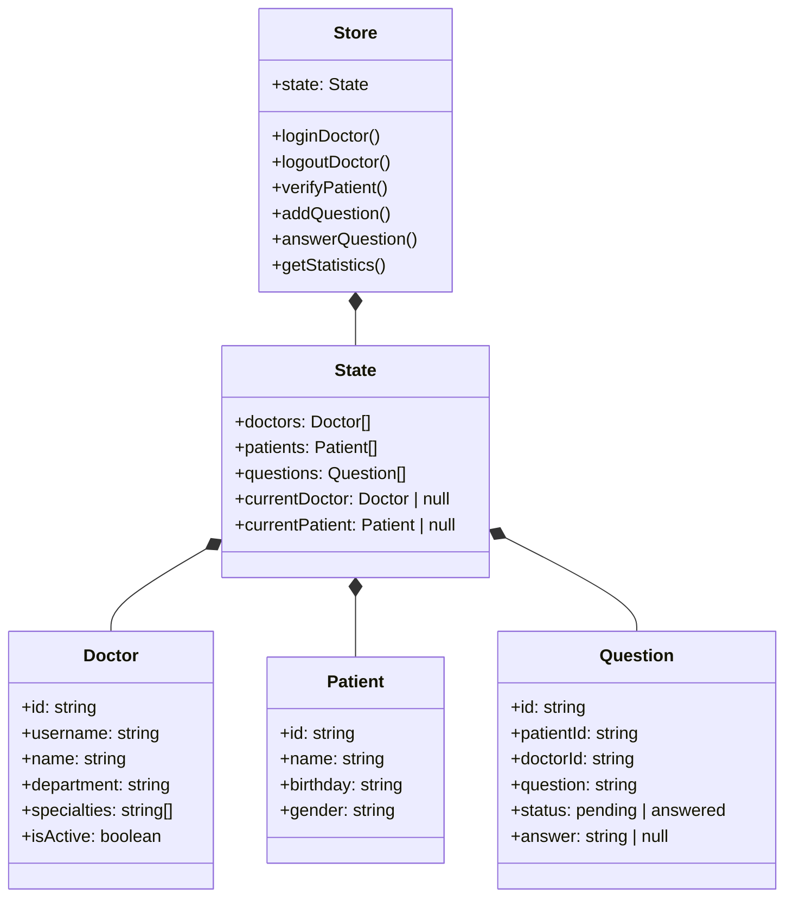
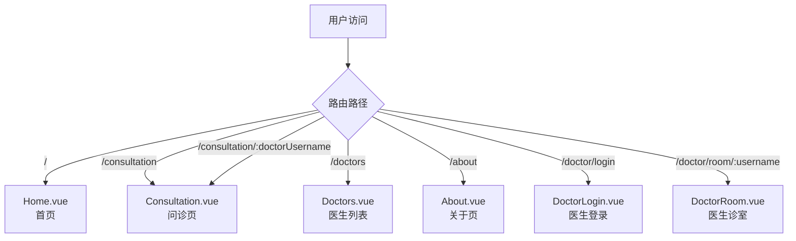
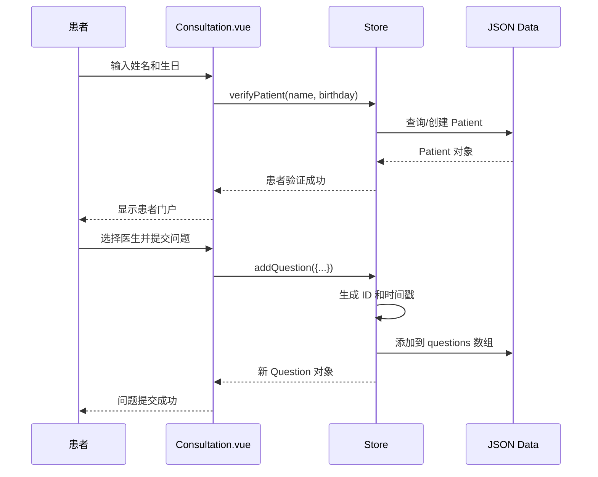
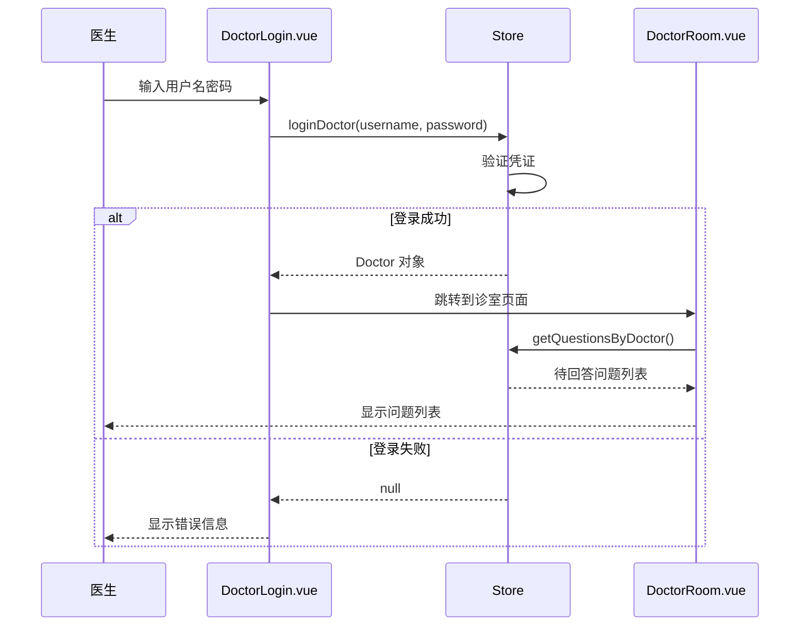
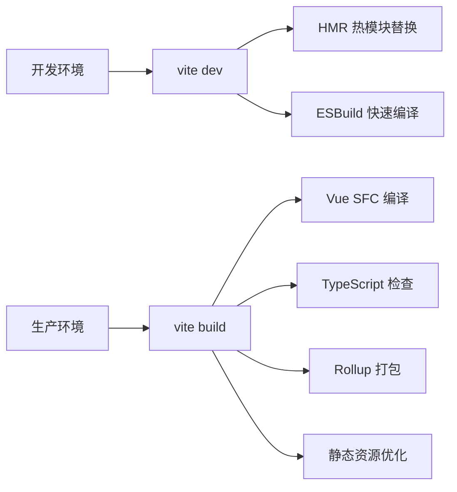
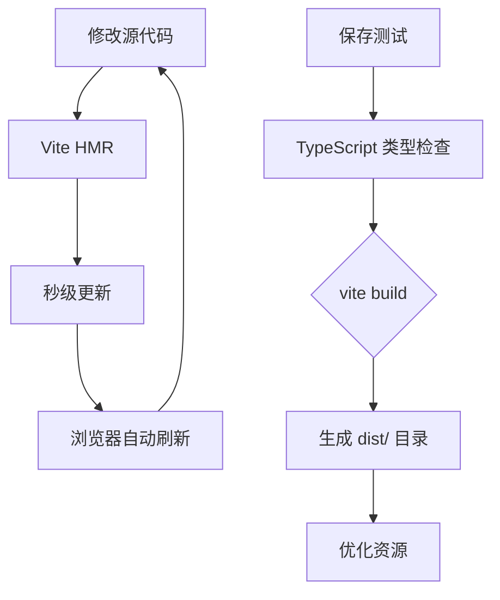

# 系统架构文档

## 概述

本文档描述了 QA Live Healthcare 在线医疗问诊平台的系统架构、设计决策和技术模式。该系统采用前端单页应用（SPA）架构，使用 Vue 3 构建，后端交互通过本地状态管理实现。

## 架构概览

### 系统架构图



### 技术栈

| 层级 | 技术 | 版本 | 说明 |
|------|------|------|------|
| **核心框架** | Vue.js | 3.5.10 | 前端渐进式框架 |
| **构建工具** | Vite | 5.4.8 | 快速的开发服务器和构建工具 |
| **语言** | TypeScript | 5.5.3 | 类型安全的 JavaScript 超集 |
| **UI 组件** | Ant Design Vue | 4.2.6 | 企业级 Vue UI 组件库 |
| **路由** | Vue Router | 4.6.3 | Vue.js 官方路由管理器 |
| **状态管理** | Vue Reactive | 内置 | 响应式状态管理系统 |
| **日期处理** | dayjs | 1.11.19 | 轻量级日期处理库 |

## 架构设计原则

### 1. 简洁至上 (Simplicity First)

采用简洁的单层 SPA 架构，避免过度设计：
- 无需复杂的后端服务
- 本地状态管理，数据存储于内存
- 快速开发和迭代

### 2. 关注点分离 (Separation of Concerns)

```
src/
├── views/        # 页面组件 - 用户界面和交互
├── components/   # 可复用组件 - UI 组件库
├── store/        # 状态管理 - 业务逻辑和数据
├── router/       # 路由管理 - 页面导航
└── data/         # 数据文件 - 静态数据源
```

### 3. 响应式设计 (Reactive Design)

利用 Vue 3 的响应式系统实现数据驱动：
- `ref()` - 包装基本类型响应式引用
- `reactive()` - 包装对象响应式代理
- `computed()` - 计算属性自动追踪依赖

### 4. 组件化思维 (Component-Based)

每个组件遵循单一职责原则：
- 页面组件 (`views/`) - 完整的页面功能
- 公共组件 (`components/`) - 可复用的 UI 组件
- 基础组件 - 原子化设计

## 核心模块架构

### 应用入口架构



### 状态管理架构



### 路由架构



## 数据流设计

### 患者问诊流程



### 医生诊流程



## 组件设计

### 页面组件结构

| 组件 | 职责 | 依赖 |
|------|------|------|
| `App.vue` | 根组件，布局容器 | AppHeader, RouterView, AppFooter |
| `Home.vue` | 首页，展示平台概览 | Store, Ant Design |
| `Consultation.vue` | 患者问诊页面 | Store, Ant Design |
| `Doctors.vue` | 医生列表页面 | Store, Ant Design |
| `DoctorLogin.vue` | 医生登录页面 | Store, Ant Design |
| `DoctorRoom.vue` | 医生诊室页面 | Store, Ant Design |
| `About.vue` | 关于页面 | - |

### 公共组件结构

| 组件 | 职责 |
|------|------|
| `AppHeader.vue` | 顶部导航栏，包含 Logo 和菜单 |
| `AppFooter.vue` | 底部版权信息 |

### 组件通信模式

```
父子组件通信:
├── Props: 父 → 子传递数据
├── Emit: 子 → 父传递事件
└── Slot: 父 → 子传递模板内容

跨组件通信:
└── Store: 共享状态，通过 computed 响应式获取
```

## 状态管理模式

### Reactive Store 模式

项目采用 Vue 3 原生的 `reactive()` API 实现状态管理：

```typescript
// 1. 定义数据类型接口
interface Doctor { ... }
interface Patient { ... }
interface Question { ... }

// 2. 定义状态结构
interface State {
  doctors: Doctor[];
  patients: Patient[];
  questions: Question[];
  currentDoctor: Doctor | null;
  currentPatient: Patient | null;
}

// 3. 创建响应式状态
const state = reactive<State>({
  doctors: doctorData as Doctor[],
  patients: patientData as Patient[],
  questions: questionData as Question[],
  currentDoctor: null,
  currentPatient: null,
});

// 4. 封装业务方法
export const store = {
  state,
  loginDoctor(username, password) { ... },
  addQuestion(data) { ... },
  // ...
};
```

### 组件中使用 Store

```typescript
// 在组件中导入和使用
import { store } from '../store';

// 直接访问状态
console.log(store.state.doctors);

// 调用业务方法
store.loginDoctor('dr-zhang-wei', '123456');

// 使用 computed 响应式获取
const activeDoctors = computed(() => 
  store.state.doctors.filter(d => d.isActive)
);
```

## 构建架构

### Vite 配置



### 开发流程



## 部署架构

### 当前架构（原型阶段）

```
┌─────────────────────────────────────────┐
│              用户浏览器                   │
│  ┌─────────────────────────────────┐    │
│  │     SPA 应用 (index.html)        │    │
│  │  ├── Vue 3 应用                  │    │
│  │  ├── Ant Design Vue 组件          │    │
│  │  └── 本地 Store (内存)            │    │
│  └─────────────────────────────────┘    │
└─────────────────────────────────────────┘
```

### 生产部署架构（未来扩展）

```
┌─────────────────────────────────────────┐
│              CDN / Nginx                 │
│           静态资源加速                    │
└──────────────────┬──────────────────────┘
                   │
                   ▼
┌─────────────────────────────────────────┐
│           API Server (Node/Express)      │
│     ┌─────────────────────────────────┐  │
│     │  - 用户认证 API                  │  │
│     │  - 问诊管理 API                  │  │
│     │  - WebSocket 实时通信            │  │
│     └─────────────────────────────────┘  │
└──────────────────┬──────────────────────┘
                   │
                   ▼
┌─────────────────────────────────────────┐
│           Database (PostgreSQL)          │
│     ┌─────────────────────────────────┐  │
│     │  - doctors 表                   │  │
│     │  - patients 表                  │  │
│     │  - questions 表                │  │
│     └─────────────────────────────────┘  │
└─────────────────────────────────────────┘
```

## 扩展性设计

### 未来扩展方向

| 扩展点 | 说明 | 优先级 |
|--------|------|--------|
| 后端 API | 接入真实后端服务 | 高 |
| 用户认证 | JWT Token 认证机制 | 高 |
| 数据库 | PostgreSQL/MySQL 数据持久化 | 高 |
| 实时通信 | WebSocket 实时消息推送 | 中 |
| 文件上传 | 头像上传、处方图片 | 低 |
| 支付集成 | 问诊费用支付 | 低 |

### 模块化扩展

项目结构支持以下扩展：

```
src/
├── services/           # API 服务层（扩展）
│   ├── auth.ts        # 认证服务
│   ├── doctor.ts      # 医生服务
│   └── question.ts    # 问诊服务
├── composables/       # 组合式函数（扩展）
│   ├── useAuth.ts     # 认证逻辑复用
│   └── useConsultation.ts
├── utils/             # 工具函数（扩展）
│   ├── request.ts     # HTTP 请求封装
│   └── storage.ts     # 本地存储封装
└── types/             # 类型定义（扩展）
    └── api.ts         # API 类型定义
```

## 安全考虑

### 当前安全措施

| 措施 | 说明 |
|------|------|
| TypeScript 类型检查 | 编译时捕获潜在错误 |
| 组件作用域样式 | `scoped` CSS 隔离 |
| 输入验证 | 表单规则验证 |

### 建议的安全增强

| 增强项 | 说明 |
|--------|------|
| XSS 防护 | 对用户输入进行转义 |
| CSRF 防护 | 实现 CSRF Token |
| 敏感数据加密 | 密码等敏感信息加密存储 |
| HTTPS | 生产环境强制 HTTPS |

## 性能优化

### 当前优化措施

| 措施 | 说明 |
|------|------|
| Vite 快速构建 | ESBuild 高速编译 |
| HMR 热更新 | 开发体验优化 |
| Tree Shaking | 自动移除未使用代码 |
| 按需加载 | 路由懒加载组件 |

### 性能指标目标

| 指标 | 目标值 |
|------|--------|
| 首屏加载时间 | < 2s |
| Vite 构建速度 | < 3s |
| HMR 更新速度 | < 100ms |

## 源代码引用

| 模块 | 文件路径 | 说明 |
|------|----------|------|
| 应用入口 | `src/main.ts` | Vue 应用初始化 |
| 根组件 | `src/App.vue` | 布局结构 |
| 路由配置 | `src/router/index.ts` | 路由定义 |
| 状态管理 | `src/store/index.ts` | Store 和业务逻辑 |
| 医生数据 | `src/data/doctor-user-list.json` | 医生数据源 |
| 患者数据 | `src/data/patient-user.json` | 患者数据源 |
| 问题数据 | `src/data/question-list.json` | 问诊数据源 |
| Vite 配置 | `vite.config.ts` | 构建配置 |

---

*本系统架构文档会随架构变更而更新。使用 `/asdm-context-update` 更新上下文。*
