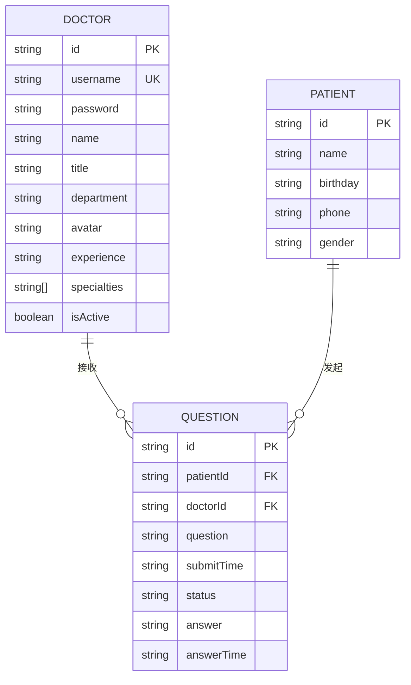
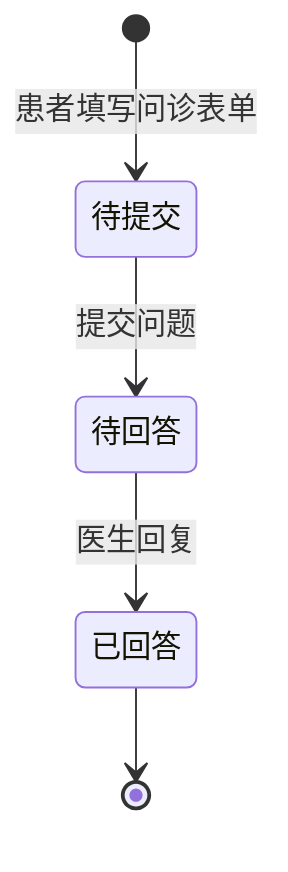
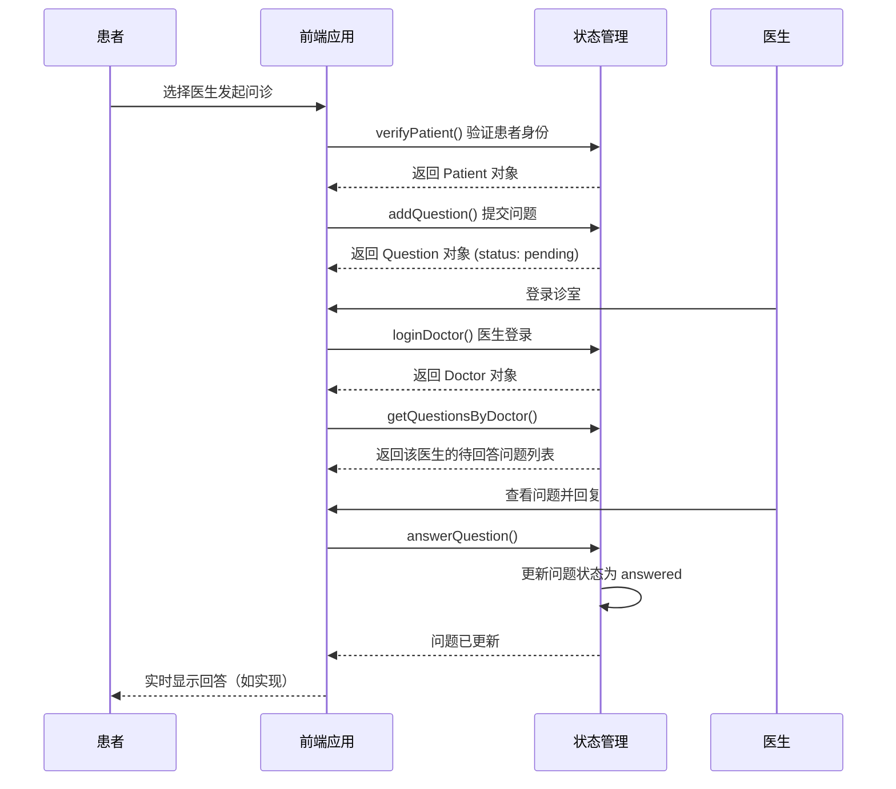
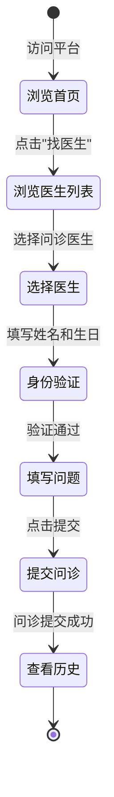
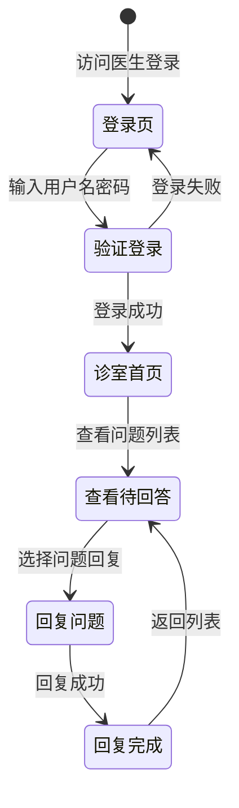

# 数据模型

## 概述

本文档描述了在线医疗问诊平台的数据模型、实体关系和数据流。它为 AI 模型提供了必要的数据结构理解，以便有效地处理代码库。

**核心实体**: 医生 (Doctor)、患者 (Patient)、问诊问题 (Question)

## 数据模型概览

### 实体关系图



### 状态机图



## 实体定义

### Doctor (医生)

**用途**: 表示平台的医生用户，包含个人信息和专业领域。

**源文件**: `src/data/doctor-user-list.json`

```typescript
interface Doctor {
  id: string;           // 唯一标识符，如 "doc001"
  username: string;      // 登录用户名，如 "dr-zhang-wei"
  password: string;       // 登录密码（未加密存储，仅用于演示）
  name: string;          // 医生姓名，如 "张伟医生"
  title: string;         // 职称，如 "主任医师"
  department: string;    // 科室，如 "心内科"
  avatar: string;        // 头像图片 URL
  experience: string;   // 从业经验，如 "15年临床经验"
  specialties: string[]; // 专业领域列表
  isActive: boolean;     // 是否在线/活跃
}
```

**医生示例数据**:

```json
{
  "id": "doc001",
  "username": "dr-zhang-wei",
  "password": "123456",
  "name": "张伟医生",
  "title": "主任医师",
  "department": "心内科",
  "avatar": "https://images.pexels.com/.../photo-5215024.jpeg",
  "experience": "15年临床经验",
  "specialties": ["高血压", "冠心病", "心律失常"],
  "isActive": true
}
```

### Patient (患者)

**用途**: 表示发起问诊的患者用户。

**源文件**: `src/data/patient-user.json`

```typescript
interface Patient {
  id: string;      // 唯一标识符，如 "patient001"
  name: string;    // 患者姓名，如 "赵明"
  birthday: string; // 出生日期，格式 "YYYY-MM-DD"
  phone: string;    // 联系电话（部分隐藏），如 "138****1234"
  gender: string;   // 性别，"男" 或 "女"
}
```

**患者示例数据**:

```json
{
  "id": "patient001",
  "name": "赵明",
  "birthday": "1985-03-15",
  "phone": "138****1234",
  "gender": "男"
}
```

### Question (问诊问题)

**用途**: 表示患者的问诊问题及其回答状态。

**源文件**: `src/data/question-list.json`

```typescript
interface Question {
  id: string;           // 唯一标识符，如 "q001"
  patientId: string;     // 关联的患者 ID
  patientName: string;  // 关联的患者姓名（冗余存储）
  doctorId: string;      // 关联的医生 ID
  doctorName: string;   // 关联的医生姓名（冗余存储）
  question: string;      // 患者的问题描述
  submitTime: string;   // 提交时间，ISO 8601 格式
  status: 'pending' | 'answered';  // 问题状态
  answer: string | null; // 医生的回答
  answerTime: string | null;  // 回答时间
}
```

**问诊示例数据**:

```json
{
  "id": "q001",
  "patientId": "patient001",
  "patientName": "赵明",
  "doctorId": "doc001",
  "doctorName": "张伟医生",
  "question": "最近总是感觉胸闷气短,特别是爬楼梯的时候,这是什么原因?",
  "submitTime": "2025-11-02T09:30:00",
  "status": "answered",
  "answer": "根据您的描述,可能是心脏功能问题。建议您做个心电图和心脏彩超检查。",
  "answerTime": "2025-11-02T09:45:00"
}
```

## 数据关系

### 一对多关系

1. **Doctor → Question**: 一个医生可以接收多个患者的问诊问题
2. **Patient → Question**: 一个患者可以发起多个问诊问题

### 数据完整性规则

- 删除医生时，应同时处理该医生的所有待回答问题
- 删除患者时，应同时删除该患者的所有问诊记录
- 问题提交后 `patientId` 和 `doctorId` 不应变更

## 状态管理 (Store)

**源文件**: `src/store/index.ts`

### State 接口

```typescript
interface State {
  doctors: Doctor[];        // 所有医生列表
  patients: Patient[];      // 所有患者列表
  questions: Question[];     // 所有问诊问题列表
  currentDoctor: Doctor | null;  // 当前登录的医生
  currentPatient: Patient | null; // 当前验证的患者
}
```

### Store 方法

```typescript
export const store = {
  // 医生管理
  loginDoctor(username: string, password: string): Doctor | null
  logoutDoctor(): void
  getDoctorByUsername(username: string): Doctor | undefined
  getActiveDoctors(): Doctor[]

  // 患者管理
  verifyPatient(name: string, birthday: string): Patient
  logoutPatient(): void

  // 问题管理
  getQuestionsByDoctor(doctorId: string): Question[]
  getQuestionsByPatient(patientId: string): Question[]
  addQuestion(question: Omit<Question, 'id' | 'submitTime' | 'status' | 'answer' | 'answerTime'>): Question
  answerQuestion(questionId: string, answer: string): void
  markQuestionAsAnswered(questionId: string): void

  // 统计分析
  getStatistics(): {
    totalDoctors: number;
    totalQuestions: number;
    activeSessions: number;  // 待回答问题数
    totalSessions: number;    // 在线医生数
  }
}
```

## 数据流程图

### 问诊流程



### 患者问诊流程



### 医生诊流程



## 数据验证规则

### 患者验证

```typescript
const patientValidation = {
  name: {
    required: true,
    minLength: 1,
    maxLength: 50,
  },
  birthday: {
    required: true,
    pattern: /^\d{4}-\d{2}-\d{2}$/,  // 格式: YYYY-MM-DD
  },
};
```

### 医生登录

```typescript
const doctorLoginValidation = {
  username: {
    required: true,
    minLength: 1,
  },
  password: {
    required: true,
    minLength: 1,
  },
};
```

### 问诊提交

```typescript
const questionValidation = {
  question: {
    required: true,
    minLength: 10,
    maxLength: 1000,
  },
  doctorId: {
    required: true,
  },
};
```

## 示例数据

### 医生列表

| ID | 用户名 | 姓名 | 科室 | 职称 | 在线状态 |
|----|--------|------|------|------|----------|
| doc001 | dr-zhang-wei | 张伟医生 | 心内科 | 主任医师 | 在线 |
| doc002 | dr-li-na | 李娜医生 | 儿科 | 副主任医师 | 在线 |
| doc003 | dr-wang-qiang | 王强医生 | 骨科 | 主治医师 | 在线 |
| doc004 | dr-liu-min | 刘敏医生 | 妇产科 | 主任医师 | 离线 |
| doc005 | dr-chen-jie | 陈杰医生 | 消化内科 | 副主任医师 | 在线 |

### 患者列表

| ID | 姓名 | 生日 | 性别 |
|----|------|------|------|
| patient001 | 赵明 | 1985-03-15 | 男 |
| patient002 | 孙丽 | 1990-07-22 | 女 |
| patient003 | 周杰 | 1978-11-08 | 男 |
| patient004 | 吴芳 | 1995-05-20 | 女 |
| patient005 | 郑浩 | 1988-09-12 | 男 |

### 问诊问题统计

| 状态 | 数量 | 说明 |
|------|------|------|
| pending | 4 | 待回答 |
| answered | 3 | 已回答 |

## 源代码引用

| 实体/功能 | 文件路径 |
|----------|----------|
| Doctor 接口 | `src/store/index.ts:6-17` |
| Patient 接口 | `src/store/index.ts:19-25` |
| Question 接口 | `src/store/index.ts:27-38` |
| Store 方法 | `src/store/index.ts:56-158` |
| 医生数据 | `src/data/doctor-user-list.json` |
| 患者数据 | `src/data/patient-user.json` |
| 问题数据 | `src/data/question-list.json` |

---

*本数据模型文档会随数据库架构或数据结构的变更而更新。使用 `/asdm-context-update` 更新上下文。*
