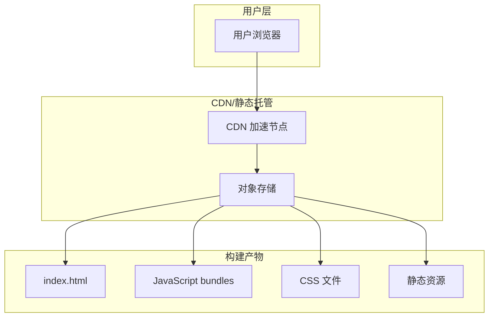
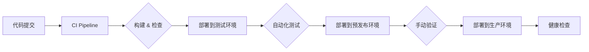

# 部署配置文档

## 概述

本文档描述了 QA Live Healthcare 在线医疗问诊平台的部署架构、配置和流程。本项目为纯前端应用，使用 Vite 构建，无需后端服务器即可运行。

## 技术栈

| 技术 | 版本 | 用途 |
|------|------|------|
| Vue | ^3.5.10 | 前端框架 |
| TypeScript | ^5.5.3 | 类型系统 |
| Vite | ^5.4.8 | 构建工具 |
| Ant Design Vue | ^4.2.6 | UI 组件库 |
| Vue Router | ^4.6.3 | 路由管理 |
| Day.js | ^1.11.19 | 日期处理 |

## 部署架构

### 系统架构图



### 部署模式对比

| 部署模式 | 适用场景 | 优点 | 缺点 |
|----------|----------|------|------|
| **静态托管** | 开发/演示 | 简单、快速 | 无 SSR |
| **CDN 加速** | 生产环境 | 全球访问、性能优化 | 成本较高 |
| **容器化** | 企业部署 | 环境一致、易扩展 | 配置复杂 |

## 环境配置

### 开发环境

```bash
# 启动开发服务器
npm run dev

# 访问地址
http://localhost:5173

# 配置说明
- HMR 热模块替换启用
- Source maps 开启
- 调试模式默认
```

### 生产构建

```bash
# 构建生产版本
npm run build

# 预览构建结果
npm run preview

# 构建产物位置
dist/
├── index.html
├── assets/
│   ├── *.js      # JavaScript  bundles
│   └── *.css     # CSS 文件
└── public/       # 静态资源
```

### 构建配置

```typescript
// vite.config.ts
export default defineConfig({
  plugins: [vue()],
  resolve: {
    alias: {
      '@': fileURLToPath(new URL('./src', import.meta.url))
    }
  },
  build: {
    target: 'esnext',
    minify: 'esbuild',
    sourcemap: false,
    rollupOptions: {
      output: {
        manualChunks: {
          'vendor': ['vue', 'vue-router', 'ant-design-vue']
        }
      }
    }
  }
})
```

## 部署流程

### 持续部署流水线



### 部署步骤

#### 1. 开发环境部署

```bash
# 安装依赖
npm install

# 启动开发服务器
npm run dev

# 运行类型检查
npm run build
```

#### 2. 预发布环境部署

```bash
# 构建生产版本
npm run build

# 使用 preview 测试
npm run preview

# 上传到预发布服务器
scp -r dist/* user@staging-server:/var/www/qa-live-healthcare/
```

#### 3. 生产环境部署

```bash
# 构建生产版本
npm run build

# 创建备份
cp -r /var/www/qa-live-healthcare /var/www/backup-$(date +%Y%m%d)

# 部署新版本
rm -rf /var/www/qa-live-healthcare
cp -r dist /var/www/qa-live-healthcare

# 验证部署
curl -I https://your-domain.com
```

## 静态托管配置

### Nginx 配置

```nginx
# /etc/nginx/conf.d/qa-live-healthcare.conf

server {
    listen 80;
    server_name qa-live-healthcare.example.com;
    root /var/www/qa-live-healthcare;
    index index.html;

    # Gzip 压缩
    gzip on;
    gzip_types text/plain text/css application/json application/javascript text/xml application/xml;
    gzip_min_length 1000;

    # 静态资源缓存
    location ~* \.(js|css|png|jpg|jpeg|gif|ico|svg|woff|woff2)$ {
        expires 1y;
        add_header Cache-Control "public, immutable";
    }

    # SPA 路由 fallback
    location / {
        try_files $uri $uri/ /index.html;
    }

    # 安全头
    add_header X-Frame-Options "SAMEORIGIN" always;
    add_header X-Content-Type-Options "nosniff" always;
    add_header X-XSS-Protection "1; mode=block" always;
}
```

### CDN 配置

```javascript
// CDN 配置示例 (适用于各大云服务商)
// 1. 将 dist 目录内容上传至 CDN
// 2. 配置自定义域名
// 3. 设置缓存策略

const cdnConfig = {
  // 腾讯云 COS
  bucket: 'qa-live-healthcare',
  region: 'ap-guangzhou',
  
  // 缓存配置
  cacheRules: [
    { Pattern: '*.js', MaxAge: 31536000 },
    { Pattern: '*.css', MaxAge: 31536000 },
    { Pattern: '*.png|*.jpg|*.svg', MaxAge: 31536000 },
    { Pattern: '/index.html', MaxAge: 0 }
  ],
  
  // 刷新配置
  autoRefresh: true
}
```

## Docker 部署

### Dockerfile

```dockerfile
# 构建阶段
FROM node:20-alpine AS builder

WORKDIR /app

COPY package*.json ./
RUN npm ci

COPY . .
RUN npm run build

# 运行阶段
FROM nginx:alpine

COPY --from=builder /app/dist /usr/share/nginx/html
COPY nginx.conf /etc/nginx/conf.d/default.conf

EXPOSE 80

CMD ["nginx", "-g", "daemon off;"]
```

### nginx.conf

```nginx
server {
    listen 80;
    server_name localhost;
    root /usr/share/nginx/html;
    index index.html;

    location / {
        try_files $uri $uri/ /index.html;
    }

    location ~* \.(js|css|png|jpg|jpeg|gif|ico|svg)$ {
        expires 1y;
        add_header Cache-Control "public, immutable";
    }
}
```

### Docker Compose

```yaml
# docker-compose.yml
version: '3.8'

services:
  web:
    build: .
    ports:
      - "80:80"
    environment:
      - NODE_ENV=production
    restart: unless-stopped
```

## 环境变量

### 可用环境变量

| 变量名 | 说明 | 默认值 |
|--------|------|--------|
| `VITE_APP_TITLE` | 应用标题 | QA Live Healthcare |
| `VITE_API_BASE_URL` | API 基础地址 | 空 |

### 配置示例

```bash
# .env.production
VITE_APP_TITLE=QA Live Healthcare
VITE_API_BASE_URL=https://api.example.com
```

## 性能优化

### 构建优化

```typescript
// vite.config.ts
export default defineConfig({
  build: {
    // 代码分割
    rollupOptions: {
      output: {
        manualChunks: {
          'vue-vendor': ['vue', 'vue-router'],
          'ui-vendor': ['ant-design-vue'],
          'utils': ['dayjs']
        }
      }
    },
    
    // CSS 代码分割
    cssCodeSplit: true,
    
    // 资源内联阈值
    assetsInlineLimit: 4096,
    
    // 压缩
    minify: 'terser',
    terserOptions: {
      compress: {
        drop_console: true,
        drop_debugger: true
      }
    }
  }
})
```

### 运行时优化

```typescript
// 路由懒加载
const routes = [
  {
    path: '/consultation',
    component: () => import('./views/Consultation.vue')
  }
]

// 组件懒加载
const AsyncComponent = defineAsyncComponent({
  loader: () => import('./components/HeavyComponent.vue'),
  loadingComponent: LoadingSpinner
})
```

## 监控与日志

### 性能监控

```typescript
// src/utils/monitor.ts
export function initMonitoring() {
  // Core Web Vitals
  import('web-vitals').then(({ getCLS, getFID, getLCP }) => {
    getCLS(console.log)
    getFID(console.log)
    getLCP(console.log)
  })
}
```

### 错误追踪

```typescript
// src/utils/errorHandler.ts
window.onerror = (message, source, lineno, colno, error) => {
  console.error('Global error:', { message, source, lineno, colno, error })
  // 可集成 Sentry 等服务
}

window.addEventListener('unhandledrejection', (event) => {
  console.error('Unhandled rejection:', event.reason)
})
```

## 安全配置

### 安全头

```nginx
# nginx.conf
add_header Strict-Transport-Security "max-age=31536000; includeSubDomains" always;
add_header X-Frame-Options "SAMEORIGIN" always;
add_header X-Content-Type-Options "nosniff" always;
add_header X-XSS-Protection "1; mode=block" always;
add_header Referrer-Policy "strict-origin-when-cross-origin" always;
```

### CSP 配置

```html
<!-- index.html -->
<meta http-equiv="Content-Security-Policy" 
      content="default-src 'self'; script-src 'self' 'unsafe-inline'; style-src 'self' 'unsafe-inline'; img-src 'self' data: https:;">
```

## 部署检查清单

### 部署前
- [ ] 所有测试通过 (`npm run build`)
- [ ] 代码审查已完成
- [ ] 类型检查通过 (`vue-tsc`)
- [ ] 构建产物已生成 (`dist/`)
- [ ] 回滚计划已准备

### 部署中
- [ ] 备份现有版本
- [ ] 执行部署脚本
- [ ] 验证文件完整性
- [ ] 检查关键页面加载

### 部署后
- [ ] 健康检查通过
- [ ] 功能验证完成
- [ ] 性能指标正常
- [ ] 监控告警正常
- [ ] 通知相关人员

## 故障排查

### 常见问题

#### 构建失败

```bash
# 清理缓存后重新构建
rm -rf node_modules dist
npm install
npm run build
```

#### 页面空白

```bash
# 检查路由配置
# 确保 base URL 正确
# 检查浏览器控制台错误
```

#### 资源加载失败

```bash
# 检查静态资源路径
# 验证 base 配置
# 确认 CDN 配置正确
```

---

*此部署文档应随基础设施或部署流程的变化而更新。*
