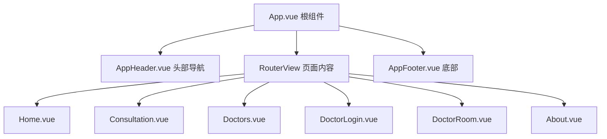

# 项目结构标准

## 概述

本文档定义了 QA Live Healthcare（在线医疗问诊平台）的标准项目结构。它为开发人员提供了文件和目录组织的指南，以保持一致性并促进协作。

## 技术栈

- **前端框架**: Vue 3.5.10（Composition API + `<script setup>` 语法）
- **UI 组件库**: Ant Design Vue 4.2.6
- **路由管理**: Vue Router 4.6.3
- **状态管理**: Vue Reactive（轻量级状态管理模式）
- **构建工具**: Vite 5.4.8
- **语言**: TypeScript 5.5.3

## 项目目录结构

```
qa-live-healthcare/
├── .asdm/                              # ASDM 配置和工具集
│   ├── contexts/                       # 上下文文件（AI 模型参考）
│   │   ├── index.md                    # 工作区索引
│   │   ├── data-models.md              # 数据模型文档
│   │   ├── standard-project-structure.md  # 本文档
│   │   └── ...                         # 其他上下文文件
│   └── toolsets/                       # 安装的工具集
│       └── context-builder/            # Context Builder 工具集
├── src/                                # 源代码目录
│   ├── main.ts                         # 应用入口点
│   ├── App.vue                         # 根组件
│   ├── vite-env.d.ts                   # Vite 类型声明
│   ├── style.css                       # 全局样式
│   ├── assets/                         # 静态资源
│   │   └── vue.svg                     # Vue Logo
│   ├── components/                     # 可复用组件
│   │   ├── AppHeader.vue               # 顶部导航栏
│   │   ├── AppFooter.vue               # 底部版权信息
│   │   └── HelloWorld.vue              # 示例组件
│   ├── views/                          # 页面视图（路由组件）
│   │   ├── Home.vue                    # 首页
│   │   ├── Consultation.vue            # 问诊页面
│   │   ├── Doctors.vue                 # 医生列表
│   │   ├── DoctorLogin.vue             # 医生登录
│   │   ├── DoctorRoom.vue              # 医生诊室
│   │   └── About.vue                   # 关于页面
│   ├── router/                         # 路由配置
│   │   └── index.ts                   # 路由定义和守卫
│   ├── store/                          # 状态管理
│   │   └── index.ts                   # 状态存储和业务逻辑
│   └── data/                           # 模拟数据
│       ├── doctor-user-list.json       # 医生用户数据
│       ├── patient-user.json           # 患者用户数据
│       └── question-list.json          # 问诊问题数据
├── public/                             # 公共静态资源
│   └── *.svg                           # SVG 图标文件
├── index.html                          # 入口 HTML 文件
├── package.json                        # 项目依赖配置
├── vite.config.ts                     # Vite 构建配置
├── tsconfig.json                       # TypeScript 配置引用
├── tsconfig.app.json                   # 应用 TypeScript 配置
├── tsconfig.node.json                  # Node.js TypeScript 配置
└── README.md                           # 项目说明文档
```

## 目录职责说明

### `.asdm/` - ASDM 配置

| 目录 | 用途 |
|------|------|
| `.asdm/contexts/` | 存放 AI 模型上下文文件，用于理解工作区 |
| `.asdm/toolsets/` | 安装的 ASDM 工具集 |

### `src/` - 源代码

| 目录 | 用途 | 包含内容 |
|------|------|----------|
| `src/assets/` | 静态资源 | 图片、图标等 |
| `src/components/` | 可复用组件 | Header、Footer 等公共组件 |
| `src/views/` | 页面视图 | 6 个主要页面组件 |
| `src/router/` | 路由配置 | 路由定义和导航守卫 |
| `src/store/` | 状态管理 | 集中式状态和业务逻辑 |
| `src/data/` | 模拟数据 | JSON 格式的初始数据 |

### 根目录配置文件

| 文件 | 用途 |
|------|------|
| `vite.config.ts` | Vite 构建配置 |
| `tsconfig.json` | TypeScript 配置引用 |
| `package.json` | NPM 依赖和脚本 |
| `index.html` | 应用入口 HTML |

## Vue 3 项目结构规范

### 组件组织



### 组件命名规范

| 类型 | 规范 | 示例 |
|------|------|------|
| 页面组件 | PascalCase + 功能描述 | `Home.vue`, `DoctorLogin.vue` |
| 公共组件 | PascalCase + 功能描述 | `AppHeader.vue`, `AppFooter.vue` |
| 示例/测试组件 | PascalCase | `HelloWorld.vue` |

### 组件文件结构

每个 Vue 组件应遵循以下结构：

```vue
<script setup lang="ts">
// 1. 导入依赖
import { ref, computed, onMounted } from 'vue';
import { useRouter } from 'vue-router';

// 2. 定义 Props 和 Emits
// const props = defineProps<{ ... }>();
// const emit = defineEmits<{ ... }>();

// 3. 响应式状态
// const state = ref(...);

// 4. 计算属性
// const computedValue = computed(...);

// 5. 方法
// const handleClick = () => { ... };

// 6. 生命周期钩子
// onMounted(() => { ... });
</script>

<template>
  <!-- 模板内容 -->
</template>

<style scoped>
/* 样式内容（可选 scoped） */
</style>
```

## 路由结构

### 路由配置

**文件**: `src/router/index.ts`

| 路径 | 组件 | 功能 | 访问权限 |
|------|------|------|----------|
| `/` | Home.vue | 首页 | 公开 |
| `/consultation` | Consultation.vue | 问诊页面 | 公开 |
| `/consultation/:doctorUsername` | Consultation.vue | 指定医生问诊 | 公开 |
| `/doctors` | Doctors.vue | 医生列表 | 公开 |
| `/about` | About.vue | 关于页面 | 公开 |
| `/doctor/login` | DoctorLogin.vue | 医生登录 | 公开 |
| `/doctor/room/:username` | DoctorRoom.vue | 医生诊室 | 需登录 |

### 路由命名规范

```typescript
{
  path: '/consultation/:doctorUsername',
  name: 'ConsultationRoom',  // PascalCase
  component: Consultation,
}
```

## 状态管理结构

### Store 设计模式

**文件**: `src/store/index.ts`

本项目采用轻量级的 Reactive 状态管理模式：

```typescript
// 1. 定义数据接口
export interface Doctor {
  id: string;
  username: string;
  // ...
}

// 2. 定义状态接口
interface State {
  doctors: Doctor[];
  currentDoctor: Doctor | null;
  // ...
}

// 3. 创建响应式状态
const state = reactive<State>({ ... });

// 4. 导出 store 对象
export const store = {
  state,
  // 方法...
};
```

### Store 方法分类

| 类别 | 方法 | 说明 |
|------|------|------|
| 医生管理 | `loginDoctor()`, `logoutDoctor()`, `getDoctorByUsername()` | 医生登录相关 |
| 患者管理 | `verifyPatient()`, `logoutPatient()` | 患者验证相关 |
| 问题管理 | `addQuestion()`, `answerQuestion()`, `getQuestionsByDoctor()` | 问诊流程相关 |
| 统计分析 | `getStatistics()` | 获取统计数据 |

## 数据文件结构

### JSON 数据文件

所有 JSON 数据文件存储在 `src/data/` 目录下：

| 文件 | 内容 | 主要字段 |
|------|------|----------|
| `doctor-user-list.json` | 医生列表 | id, username, name, department, specialties |
| `patient-user.json` | 患者列表 | id, name, birthday, gender |
| `question-list.json` | 问诊问题 | id, patientId, doctorId, question, status |

### 数据文件命名规范

```
{entity-name}-user-list.json  # 复数用户列表
{entity-name}.json            # 单个实体
question-list.json            # 问诊问题列表
```

## 配置文件规范

### TypeScript 配置

```json
{
  "compilerOptions": {
    "target": "ES2020",
    "useDefineForClassFields": true,
    "module": "ESNext",
    "lib": ["ES2020", "DOM", "DOM.Iterable"],
    "skipLibCheck": true,
    "moduleResolution": "bundler",
    "strict": true,
    "jsx": "preserve"
  }
}
```

### Vite 配置

```typescript
import { defineConfig } from 'vite';
import vue from '@vitejs/plugin-vue';

export default defineConfig({
  plugins: [vue()],
});
```

### package.json 脚本

| 脚本 | 命令 | 说明 |
|------|------|------|
| `dev` | `vite` | 启动开发服务器 |
| `build` | `vue-tsc && vite build` | 生产构建（包含类型检查） |
| `preview` | `vite preview` | 预览生产构建 |

## 代码组织原则

### 1. 模块化

```
src/
├── components/    # 可复用 UI 组件
├── views/         # 页面级组件
├── router/        # 路由相关
├── store/         # 状态管理
└── data/          # 数据文件
```

### 2. 单一职责

每个文件应专注于单一功能：
- `AppHeader.vue` - 只负责顶部导航
- `store/index.ts` - 只负责状态管理
- `router/index.ts` - 只负责路由配置

### 3. 清晰的数据流

```
用户操作 → 组件事件 → Store 方法 → 状态更新 → 响应式渲染
```

### 4. 类型安全

- 使用 TypeScript 接口定义所有数据结构
- Props 和 Emits 使用类型化定义
- 避免使用 `any` 类型

## 样式规范

### 全局样式

**文件**: `src/style.css`

- 定义全局 CSS 变量
- 设置基础重置样式
- 定义字体和颜色主题

### 组件样式

- 使用 `<style scoped>` 隔离组件样式
- 使用 BEM 或语义化命名
- 避免深度选择器（`:deep()`）

### 响应式断点

```css
/* 移动端优先 */
@media (max-width: 768px) { /* 手机 */ }
@media (min-width: 769px) { /* 平板 */ }
@media (min-width: 1024px) { /* 桌面 */ }
```

## 新增功能指南

### 添加新页面

1. 在 `src/views/` 创建新的 Vue 组件
2. 在 `src/router/index.ts` 添加路由配置
3. 在 `AppHeader.vue` 添加导航菜单项

### 添加新组件

1. 在 `src/components/` 创建 Vue 组件
2. 在需要的页面中导入使用
3. 使用 PascalCase 命名

### 添加新数据类型

1. 在 `src/store/index.ts` 添加 TypeScript 接口
2. 如需初始数据，在 `src/data/` 创建 JSON 文件
3. 在 store 中导入并初始化

## 源代码引用

| 文件/目录 | 路径 | 说明 |
|----------|------|------|
| 根组件 | `src/App.vue` | 应用根组件 |
| 入口文件 | `src/main.ts` | Vue 应用初始化 |
| 路由配置 | `src/router/index.ts` | 7 条路由定义 |
| 状态管理 | `src/store/index.ts` | 所有状态和业务逻辑 |
| 页面组件 | `src/views/*.vue` | 6 个页面组件 |
| 公共组件 | `src/components/*.vue` | 3 个公共组件 |

---

*本项目结构文档会随项目演进而更新。使用 `/asdm-context-update` 更新上下文。*
